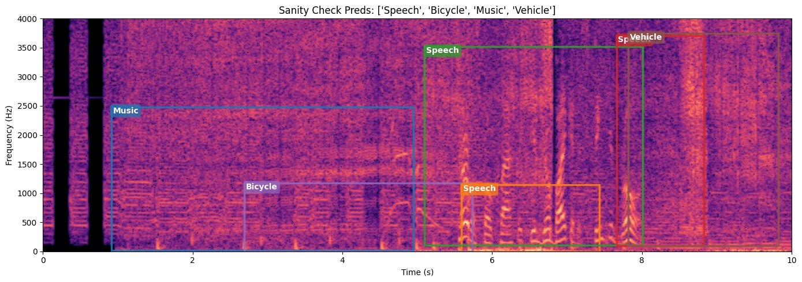

# TF-SED AudioSet Time-Frequency Boxes

Weak **2-D time-frequency bounding boxes** (time *and* frequency extent) for a
subset of [AudioSet](https://research.google.com/audioset/). Annotations only —
no audio is included.



*Boxes for a clip labelled Speech / Bicycle / Music / Vehicle, drawn over its
spectrogram. Each box localizes an event in both time and frequency.*

## Using the data

Load the manifest and parse the per-clip boxes:

```python
from datasets import load_dataset
import json

ds = load_dataset("YOUR_USERNAME/tfsed-audioset-boxes", split="train")
row = ds[0]
boxes = json.loads(row["weak_labels_json"])
# boxes[0] -> {"label": "Speech", "onset_s": 0.26, "offset_s": 4.59,
#              "freq_low_hz": 281.2, "freq_high_hz": 3781.2, ...}
```

The audio is **not** in this repo (AudioSet clips are YouTube content). Get it
from [`agkphysics/AudioSet`](https://huggingface.co/datasets/agkphysics/AudioSet)
and pair by `clip_idx`, which is the position in that dataset's **unshuffled
`train`** stream:

```python
from datasets import load_dataset

stream = load_dataset("agkphysics/AudioSet", split="train", streaming=True)
for i, clip in enumerate(stream):
    if i == row["clip_idx"]:
        wav = clip["audio"]["array"]        # 16 kHz mono after resampling
        sr  = clip["audio"]["sampling_rate"]
        break
```

### Fields

`metadata.csv` has one row per clip; `weak_labels_json` is a JSON array of boxes.

| field | meaning |
|---|---|
| `clip_idx` | index into the unshuffled `agkphysics/AudioSet` train stream |
| `dataset_labels` | pipe-separated AudioSet labels for the clip |
| `weak_labels_json` | list of boxes |

Each box: `label`, `onset_s`, `offset_s`, `freq_low_hz`, `freq_high_hz`. (The
extra `band` / `spectral_character` / `time_evolution` fields are raw model
commentary and inconsistent — use the five fields above.)

## Annotation procedure

Boxes are machine-generated and refined against the spectrogram. Per clip:

1. **Windowing** — 5 s sliding windows, 2.5 s hop.
2. **Multimodal prediction** — each window is given to
   `Qwen/Qwen3-Omni-30B-A3B-Instruct` as both a gridded 0–4 kHz spectrogram
   image and the raw 16 kHz audio, conditioned on the clip's AudioSet labels;
   the model returns JSON boxes.
3. **Energy refinement** — each box is snapped to actual STFT energy
   (percentile thresholding + morphology), so the frequency bounds track the
   signal rather than the raw model estimate.
4. **Cross-window NMS** — same-label boxes merged across overlapping windows at
   IoU > 0.3.
5. **Label snapping** — labels mapped to the official 527 AudioSet classes;
   unmappable labels dropped.

Full pipeline: [`scripts/tfsed_pipeline.ipynb`](scripts/tfsed_pipeline.ipynb).
Labels are weak (model-generated, not human-verified).

## License

Annotations: CC-BY-4.0. Audio is not distributed — obtain it from AudioSet.
